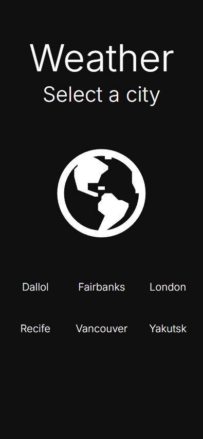
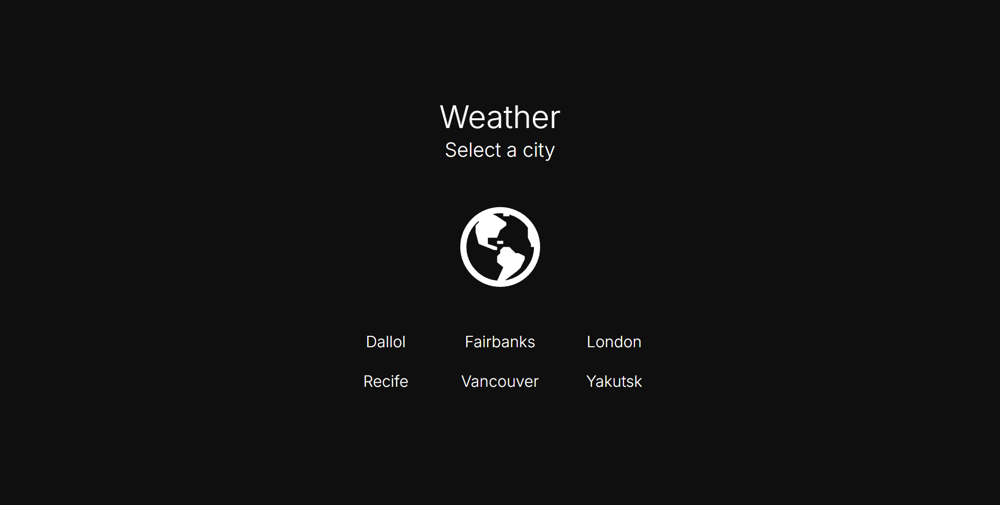
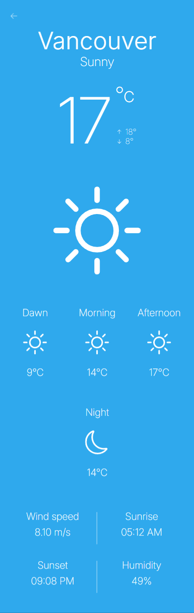
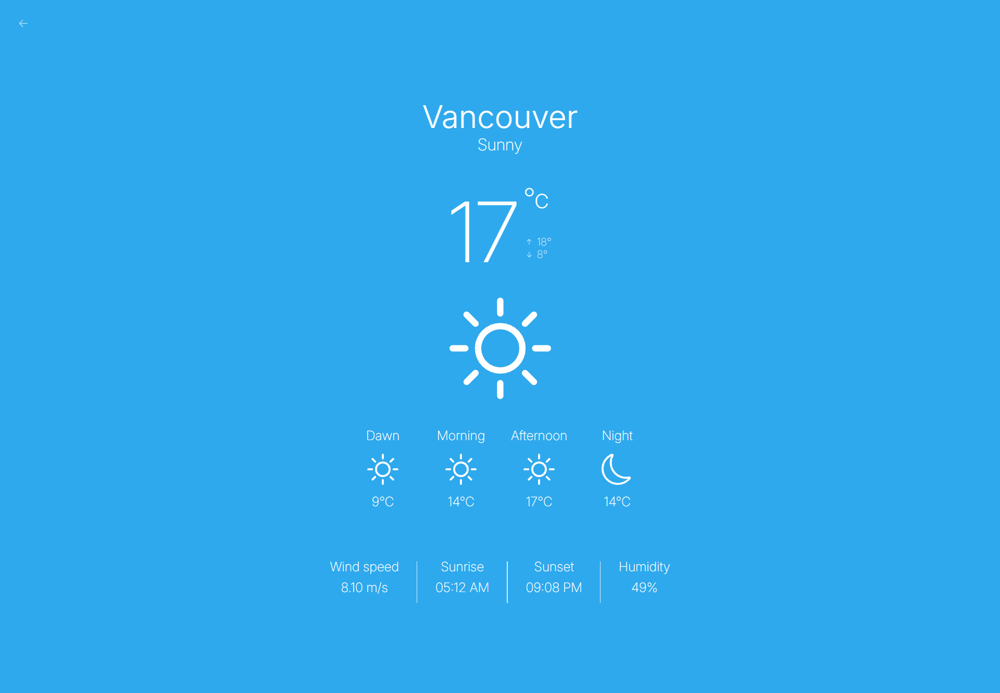
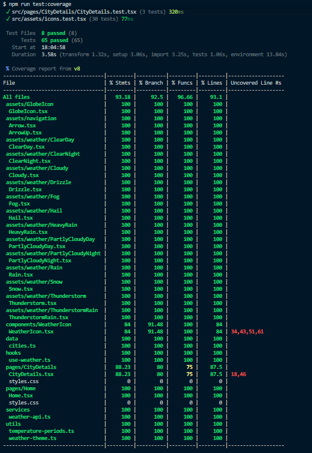

# Weather App

A responsive weather application built with React, TypeScript and WeatherAPI.

The application allows users to browse a predefined list of cities and view detailed weather information, including current conditions, temperatures throughout the day and additional weather metrics.

A live version of the application is available at:

https://desafio-de-front-end-eight.vercel.app/

---

## Preview

### Home - Mobile



### Home - Desktop



### City Details - Mobile



### City Details - Desktop



---

The layout was implemented responsively and tested across mobile, tablet and desktop widths.

---

## Test Coverage

Current test coverage:



Tested areas:

- SVG icon components
- WeatherIcon component
- useWeather hook
- Weather API service
- Home page
- City Details page
- Weather utilities
- Temperature period calculations

---

## Challenge Requirements Checklist

- [x] React + Vite
- [x] Weather API integration
- [x] Responsive layout (mobile, tablet and desktop)
- [x] Unit tests
- [x] Figma-based implementation
- [x] Docker support
- [x] Deployment on Vercel

---

## Features

- Predefined city list
- Weather details page
- Current weather conditions
- Dynamic weather themes
- Temperature periods:
  - Dawn (03:00)
  - Morning (09:00)
  - Afternoon (15:00)
  - Night (21:00)
- Responsive layout
  - Mobile
  - Tablet
  - Desktop
- Accessibility support
- Automated tests

---

## Tech Stack

### Front-end

- React 19
- TypeScript
- Vite
- React Router

### Data Fetching

- TanStack Query

### Testing

- Vitest
- React Testing Library
- Jest DOM

### API

- WeatherAPI

### Deployment

- Vercel

### Containerization

- Docker
- Nginx

---

## Installation

Install dependencies:

```bash
npm install
```

---

## Environment Variables

Create a `.env` file in the project root:

```env
VITE_WEATHER_API_KEY=your_api_key
```

You can obtain a free API key from:

https://www.weatherapi.com/

An example file is available in:

```txt
.env.example
```

---

## Running the Application

Start the development server:

```bash
npm run dev
```

Application:

```txt
http://localhost:5173
```

---

## Running Tests

Run tests:

```bash
npm run test
```

Run coverage:

```bash
npm run test:coverage
```

Run Vitest UI:

```bash
npm run test:ui
```

---

## Production Build

Generate a production build:

```bash
npm run build
```

Preview the production build locally:

```bash
npm run preview
```

---

## Docker

Build the Docker image:

```bash
docker build \
  --build-arg VITE_WEATHER_API_KEY=your_api_key \
  -t weather-app .
```

Run the container:

```bash
docker run --rm -p 8080:80 weather-app
```

Application:

```txt
http://localhost:8080
```

---

## Project Structure

```txt
src/
├── assets/
├── components/
├── data/
├── hooks/
├── pages/
├── routes/
├── services/
├── types/
├── utils/
└── tests/
```

---

## Accessibility

The project follows accessibility best practices:

- Semantic HTML
- Keyboard navigation
- Screen-reader friendly labels
- Accessible navigation links

---

## Architecture Decisions

### React Query for Server State

Weather data is managed through TanStack Query instead of local component state.

Benefits:

- Automatic caching
- Request deduplication
- Loading and error state management
- Simplified data fetching logic

### SVG Icons as React Components

All application icons are implemented as React components rather than image assets.

Benefits:

- Easy styling through CSS
- Better integration with the design system
- No additional network requests
- Reusable and type-safe components

### Utility-Driven Business Logic

Weather-related calculations and mappings are isolated into utility functions.

Examples:

- `getTemperaturePeriods`
- `getWeatherTheme`

Benefits:

- Easier testing
- Improved maintainability
- Separation of UI and business logic

### Component Composition

The application is built using reusable and composable components.

Examples:

- `WeatherIcon`
- `Arrow`
- Weather information sections
- Temperature period cards

Benefits:

- Reusability
- Easier maintenance
- Improved readability

### Responsive-First Approach

The application was implemented following the provided Figma specifications and validated across multiple screen sizes.

Benefits:

- Consistent user experience
- Pixel-accurate implementation
- Better usability across devices

### Type Safety

TypeScript is used throughout the application.

Benefits:

- Safer refactoring
- Reduced runtime errors
- Improved developer experience

### Testing Strategy

The project focuses on testing behavior rather than implementation details.

Covered areas include:

- Pages
- Components
- Hooks
- Services
- Utilities
- SVG assets

---

## Author

Developed as a Front-end Technical Challenge using React, TypeScript and modern testing practices.